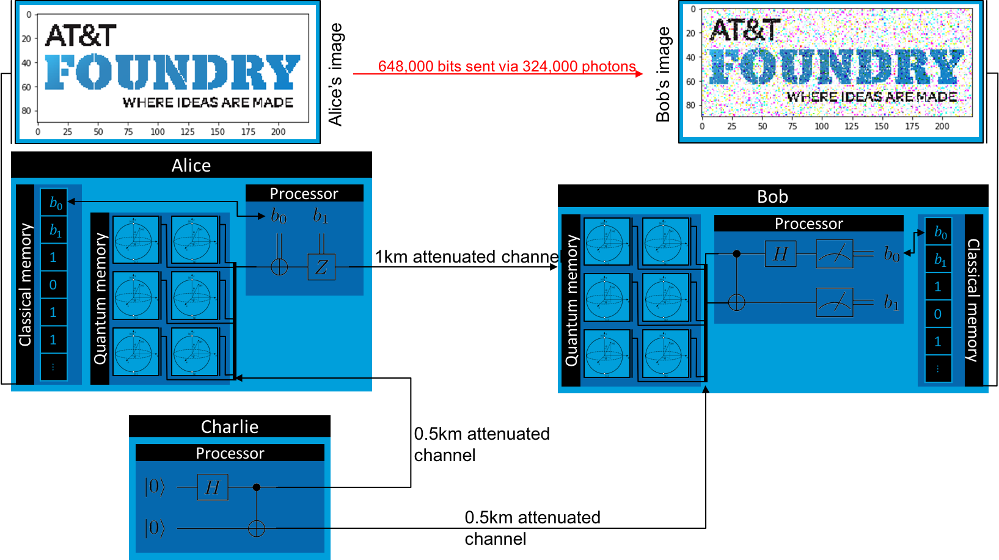

---

SQUANCH (Simulator for QUAntum Networks and CHannels) is an open-source Python framework for creating performant and 
parallelized simulations of distributed quantum information processing. Although it can be used as a general-purpose 
quantum computing simulation library, SQUANCH is designed specifically for simulating quantum *networks*, acting as a 
sort of "quantum playground" to test ideas in quantum transmission and networking protocols. The package includes 
flexible modules that allow you to intuitively design and simulate a multi-party quantum network, extensible quantum 
and classical error models which introduce realism and the need for error correction in your simulations, and a 
multi-threaded framework for manipulating quantum information in a performant manner.

SQUANCH is developed as part of the Intelligent Quantum Networks and Technologies ([INQNET](http://inqnet.caltech.edu)) 
program, a collaboration between AT&T and the California Institute of Technology. 

## Documentation

Documentation for this package is available at the [documentation website](https://att-innovate.github.io/squanch/) or 
as a pdf manual [here](/docs/SQUANCH.pdf).

## Installation 

You can install SQUANCH directly using the Python package manager pip:

```
pip install squanch
```

If you don't have pip, you can get it using `easy_install pip`.

## Demonstrations

Demonstrations of SQUANCH's capabilities can be found in the [demos](/demos) folder and in the [documentation](https://att-innovate.github.io/squanch/demos.html).

As a simple demonstration to put in this readme, let's consider a simulation of
a transmission of classical data via [quantum superdense coding](https://en.wikipedia.org/wiki/Superdense_coding). In this
scenario, we have three agents, Alice, Bob, and Charlie. Charlie will distribute Bell pairs between Alice and Bob, then Alice will 
send data to Bob by encoding two bits in the Pauli-X and -Z operations for each of her photons. Bob receives Alice's photons and 
disentangles them to reconstruct her information, as shown in the following diagram.



Simulating complex scenarios with multiple agents like this one is what SQUANCH is designed to do. The quantum states of large
numbers of particles can be efficiently dealt with using `QStream` objects, and the behavior of each agent can be defined by 
extending the built-in `Agent` class. The entire simulation runs in parallel in separate processes for each agent.
The code necessary to simulate this scenario is given below.

```python
import numpy as np
import matplotlib.image as image
import matplotlib.pyplot as plt
from squanch import *

# Alice sends information to Bob via superdense coding
class Alice(Agent):
    def run(self):
        for _ in self.stream:
            bit1 = self.data.pop(0)
            bit2 = self.data.pop(0)
            q = self.qrecv(charlie)
            if q is not None:
                if bit2 == 1: X(q)
                if bit1 == 1: Z(q)
            self.qsend(bob, q)

# Bob receives Alice's transmissions and reconstructs her information
class Bob(Agent):
    def run(self):
        bits = []
        for _ in self.stream:
            a = self.qrecv(alice)
            c = self.qrecv(charlie)
            if a is not None and c is not None:
                CNOT(a, c)
                H(a)
                bits.extend([a.measure(), c.measure()])
            else:
                bits.extend([0,0])
        self.output(bits)

# Charlie distributes Bell pairs between Alice and Bob
class Charlie(Agent):
    def run(self):
        for qsys in self.stream:
            a, b = qsys.qubits
            H(a)
            CNOT(a, b)
            self.qsend(alice, a)
            self.qsend(bob, b)

# Load an image and serialize it to a bitstream
img = image.imread("/docs/source/img/foundryLogo.bmp")
bits = list(np.unpackbits(img))

# Allocate a shared Hilbert space and output object to pass to agents
mem = Agent.shared_hilbert_space(2, int(len(bits) / 2))
out = Agent.shared_output()

# Make agent instances and connect them over simulated fiber optic lines
alice = Alice(mem, out, data = bits)
bob = Bob(mem, out)
charlie = Charlie(mem, out)
alice.qconnect(bob, FiberOpticQChannel, length = 1.0)
charlie.qconnect(alice, FiberOpticQChannel, length = 0.5)
charlie.qconnect(bob, FiberOpticQChannel, length = 0.5)

# Run the simulation and display what Bob receives
Simulation(alice, bob).run()
received_img = np.reshape(np.packbits(out["Bob"]), img.shape)
plt.imshow(received_img)
``` 

